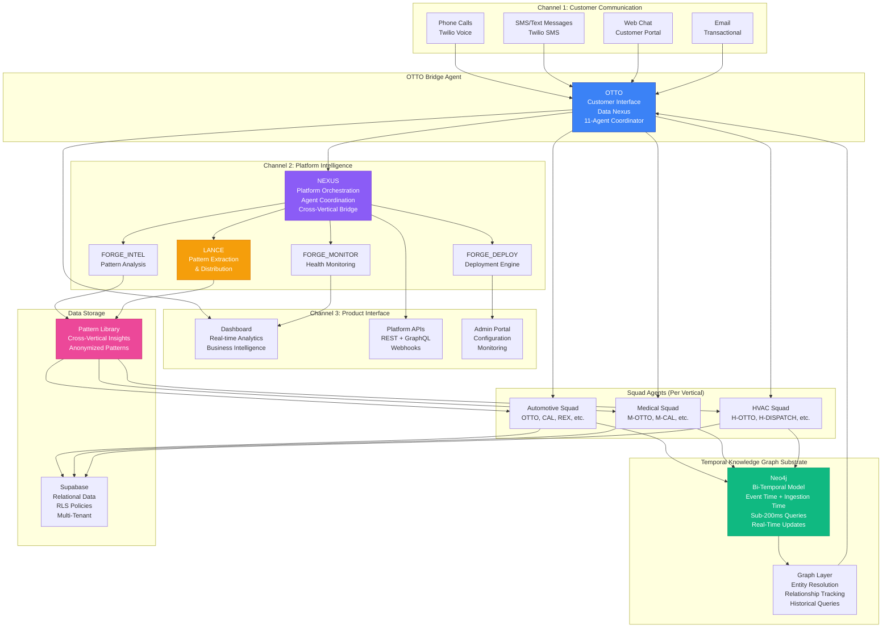

# Cobalt AI Platform - Complete Platform Documentation
**The Multi-Vertical AI Platform That Powers Everything**

**Version:** 1.0  
**Date:** 2025-12-20  
**Status:** Production Documentation - Platform Layer

---

## Table of Contents

1. [Platform Overview](#1-platform-overview)
2. [Platform Architecture](#2-platform-architecture)
3. [Platform APIs](#3-platform-apis)
4. [Database Architecture](#4-database-architecture)
5. [Vertical Deployment Automation](#5-vertical-deployment-automation)
6. [Cost Allocation System](#6-cost-allocation-system)
7. [LANCE Coordinator](#7-lance-coordinator)

---

## 1. PLATFORM OVERVIEW

### What is Cobalt AI Platform?

**Cobalt AI Platform** is the shared infrastructure layer that powers multiple vertical-specific AI solutions, including Auto Intel GTP (automotive), Cobalt Medical (healthcare), and future verticals like HVAC, legal, and retail. Unlike traditional vertical SaaS companies that build isolated solutions for each industry, Cobalt AI Platform provides a reusable foundation that enables rapid vertical deployment—typically in under 7 days—while maintaining strict data isolation and compliance separation.

The platform is built on a revolutionary architecture that allows verticals to learn from each other's insights (e.g., "48-hour confirmations reduce no-shows by 32%") without exposing any customer data, enabling faster innovation while maintaining regulatory compliance. This creates an insurmountable competitive moat: competitors would need 24-30 months to replicate the platform's capabilities.

### The Forge vs The Squad

The platform architecture distinguishes between two types of agents:

**The Forge (Platform-Level Agents):**
- **FORGE_DEPLOY:** Automated vertical deployment engine
- **FORGE_MONITOR:** Platform-wide health monitoring and alerting
- **FORGE_INTELLIGENCE:** Cross-vertical pattern analysis and insight generation
- **LANCE:** Learning Across Network of Cobalt Entities (pattern extraction and distribution)

These agents operate at the platform level, managing infrastructure, coordinating deployments, and facilitating cross-vertical learning. They are invisible to end customers and operate behind the scenes to ensure platform reliability and continuous improvement.

**The Squad (Vertical-Specific Agents):**
- **Automotive:** OTTO, CAL, REX, MILES, DEX, FLO, MAC, KIT, VIN, BLAZE, PENNYP, ROY, GUARDIAN
- **Medical:** M-OTTO, M-CAL, M-REX, M-MILES, M-DEX, M-FLO, M-MAC, M-KIT, M-VIN, M-BLAZE, M-PENNYP, M-ROY, M-GUARDIAN
- **HVAC:** H-OTTO, H-DISPATCH, H-SCHEDULE, etc.

Squad agents are deployed per-vertical and handle customer-facing operations specific to each industry. They are the agents customers interact with directly, providing domain-specific expertise and industry-tailored solutions.

### How Does Platform Enable Rapid Vertical Deployment?

The platform achieves rapid vertical deployment through a sophisticated 80/20 architecture: 80% of the infrastructure, agents, formulas, and workflows are reusable across verticals, while only 20% requires vertical-specific customization. When deploying a new vertical, the platform automatically:

1. **Deploys Base Infrastructure:** Database schemas, knowledge graphs, API infrastructure, and monitoring systems are provisioned automatically using Infrastructure-as-Code
2. **Adapts Existing Agents:** Squad agents are cloned and adapted for the new vertical, with system prompts modified for industry-specific language and requirements
3. **Customizes Formulas:** Industry-agnostic formulas (e.g., churn prediction, retention scoring) are adapted with vertical-specific parameters
4. **Configures Workflows:** Standard automation workflows are configured with industry-specific integrations (EHR for medical, shop management for automotive)
5. **Enables Cross-Learning:** New vertical immediately gains access to the pattern library, learning from successful patterns across all existing verticals

The result: a new vertical can go from concept to production in under 7 days (target: under 3 days with parallel work), compared to 6-12 months for traditional vertical SaaS companies building from scratch.

### Why This Creates an Insurmountable Moat (24-30 Months)

The competitive moat is not just technical—it's architectural and temporal. Competitors cannot simply copy individual features; they must replicate the entire platform architecture, which requires:

**1. Temporal Knowledge Graph:** Bi-temporal tracking with sub-200ms query performance, real-time entity resolution, and graph traversal optimization. Competitors would need 12-18 months to build equivalent capabilities.

**2. Tri-Channel Architecture:** Three-channel learning system (customer communication, platform intelligence, product interface) that creates 3x learning rate compared to single-channel systems. This architectural advantage takes 6-9 months to replicate.

**3. Cross-Vertical Pattern Library:** Anonymized pattern extraction and distribution system that enables insights to transfer between verticals without data exposure. Building this requires 9-12 months of development.

**4. Deployment Automation:** 8-step automated deployment workflow with rollback capabilities, health monitoring, and validation testing. Creating equivalent automation requires 6-9 months.

**5. Agent Coordination:** Sophisticated agent orchestration layer (NEXUS) that coordinates Forge and Squad agents seamlessly. Replicating this requires 9-12 months.

**Total Replication Time:** 24-30 months minimum, assuming competitors start today with full resources. By that time, Cobalt AI Platform will have 5-10 verticals operational, thousands of patterns in the library, and continuous learning advantages that compound over time.

The moat is not just technical—it's time. Every month that passes increases the gap, as the platform learns from more verticals, accumulates more patterns, and improves its capabilities faster than any competitor can replicate.

---

## 2. PLATFORM ARCHITECTURE

### Tri-Channel Architecture

The Cobalt AI Platform uses a **tri-channel architecture** that creates a 3x learning rate compared to traditional single-channel systems. This architecture ensures that learning happens at three distinct layers simultaneously, accelerating innovation and improvement.



### Channel 1: Customer Communication (Human-Facing)

The first channel handles all direct customer interactions across multiple communication channels: phone calls, SMS/text messages, web chat, and email. This channel is the primary customer touchpoint and generates the raw interaction data that feeds into the learning system.

**Key Characteristics:**
- **Multi-Channel Support:** Customers can reach the system through any preferred channel
- **Real-Time Processing:** All interactions are processed in real-time with sub-second response times
- **Context Preservation:** Customer history, preferences, and relationships are maintained across all channels
- **Personalization:** Every interaction is personalized based on complete customer context

**Learning Mechanism:**
Channel 1 generates raw interaction data (conversations, outcomes, customer satisfaction) that is processed by Channel 2 to extract insights and patterns. Every customer interaction becomes a learning opportunity.

### Channel 2: Platform Intelligence (Machine-Facing)

The second channel operates at the platform level, orchestrating agents, analyzing patterns, and facilitating cross-vertical learning. This channel includes the Forge agents (platform-level) and NEXUS (the orchestration layer).

**Key Components:**

**NEXUS - Platform Orchestration Service:**
- Coordinates Forge and Squad agents across all verticals
- Manages agent communication and data flow
- Handles cross-vertical pattern distribution
- Ensures vertical isolation while enabling learning

**FORGE_DEPLOY - Deployment Engine:**
- Automates vertical deployment (8-step workflow)
- Provisions infrastructure (database, knowledge graph, agents)
- Validates deployments and manages rollbacks
- Tracks deployment health and success metrics

**FORGE_MONITOR - Health Monitoring:**
- Monitors platform-wide health and performance
- Tracks agent performance, API latency, error rates
- Alerts on anomalies and critical failures
- Provides health dashboards for operations team

**FORGE_INTELLIGENCE - Pattern Analysis:**
- Analyzes patterns across all verticals
- Identifies high-value insights for extraction
- Scores pattern effectiveness and adoption
- Coordinates with LANCE for pattern extraction

**LANCE - Learning Coordinator:**
- Extracts patterns from vertical operations (anonymized)
- Distributes patterns to relevant verticals
- Tracks pattern adoption and effectiveness
- Continuously improves pattern quality

**Learning Mechanism:**
Channel 2 processes Channel 1's interaction data to extract insights, creates patterns, and distributes them across verticals. This creates a compounding learning effect where each vertical benefits from the collective intelligence of all verticals.

### Channel 3: Product Interface (Always-Current UI)

The third channel provides the product interfaces that customers and operators interact with: dashboards, APIs, and admin portals. This channel is always-current because it queries live data from the knowledge graph and relational databases.

**Key Components:**

**Dashboard:**
- Real-time analytics and business intelligence
- Customer metrics, revenue tracking, operational efficiency
- Agent performance metrics and health status
- Pattern effectiveness and adoption tracking

**Platform APIs:**
- REST and GraphQL APIs for programmatic access
- Webhook support for real-time event notifications
- API documentation and SDK support
- Rate limiting and authentication

**Admin Portal:**
- Configuration and management interfaces
- Deployment monitoring and control
- Pattern library browsing and adoption
- System health and alert management

**Learning Mechanism:**
Channel 3 provides visibility into system performance and enables operators to identify optimization opportunities, which feed back into Channel 2 for continuous improvement.

### Why 3 Channels = 3x Learning Rate (Not Just 1.5x)

Traditional systems use a single channel (customer communication), which means learning happens linearly: interactions → analysis → improvements. The tri-channel architecture creates a multiplicative learning effect:

**Channel 1 → Channel 2:** Customer interactions generate data for pattern extraction (1x learning)
**Channel 2 → Channel 3:** Pattern analysis provides insights for optimization (1x learning)
**Channel 3 → Channel 1:** Optimizations improve customer interactions (1x learning)

The three channels operate in parallel and feed into each other, creating a learning loop that compounds over time. The result is not 1.5x improvement (sequential) but 3x improvement (parallel + compounding).

Additionally, cross-vertical learning means patterns discovered in one vertical immediately benefit all verticals, further accelerating the learning rate. If Automotive discovers a pattern that improves conversion by 10%, Medical and HVAC immediately gain access to that pattern, creating a network effect that traditional vertical SaaS companies cannot replicate.

### Dual-Use Bridge Agents

The platform architecture includes two critical bridge agents that enable seamless coordination between channels:

**OTTO Bridge: Customer Interface + Data Nexus**

OTTO serves dual purposes:
1. **Customer Interface:** OTTO is the primary customer-facing agent, handling all direct customer interactions across all channels
2. **Data Nexus:** OTTO coordinates 11 specialized Squad agents, synthesizing their responses into coherent recommendations

OTTO is invisible to competitors because the API looks like a standard chatbot or conversational AI. Behind the scenes, OTTO orchestrates a sophisticated multi-agent system, queries the temporal knowledge graph for context, and delivers personalized recommendations that improve over time.

**Why This Is Invisible:**
- Customers interact with OTTO through standard channels (phone, SMS, chat)
- API responses appear to come from a single intelligent agent
- Competitors see standard conversational AI, not the underlying architecture
- The coordination layer (NEXUS) operates behind the scenes

**NEXUS Bridge: Integration Specialist + Network Coordinator**

NEXUS serves dual purposes:
1. **Integration Specialist:** NEXUS handles integration with external systems (Tekmetric, EHR systems, payment processors)
2. **Network Coordinator:** NEXUS coordinates agents across verticals, facilitating cross-vertical learning and pattern distribution

NEXUS is invisible to competitors because integrations appear standard and coordination happens internally. Competitors cannot see the cross-vertical pattern distribution or the sophisticated agent coordination that enables rapid learning.

### Temporal Knowledge Graph

The Temporal Knowledge Graph is the foundational substrate that enables all platform capabilities. It provides bi-temporal tracking, sub-200ms query performance, and real-time incremental updates.

**Bi-Temporal Model:**

The graph tracks two time dimensions:
1. **Event Time (`valid_from` / `valid_to`):** When a fact was true in the real world
2. **Ingestion Time (`ingested_at` / `invalidated_at`):** When the system learned or unlearned the fact

This enables point-in-time queries (e.g., "Who was Sarah's mechanic in August 2024?") and historical relationship tracking, which is critical for personalized recommendations and temporal analytics.

**Sub-200ms Query Performance:**

The knowledge graph achieves sub-200ms query latency (95th percentile) through:
- **Hybrid Retrieval Engine:** Combines semantic search (embeddings), keyword search (BM25), and graph traversal
- **Optimized Indexes:** 9+ indexes on critical node properties (name, ID, dates, types)
- **Query Optimization:** Cypher query optimization and caching strategies
- **Horizontal Scaling:** Neo4j clustering for high availability and performance

**Real-Time Incremental Updates:**

Every customer interaction triggers immediate entity resolution and graph updates:
- Entity extraction from unstructured text (<1s per conversation)
- Relationship creation with temporal validity
- Historical relationship invalidation (not deletion)
- Graph traversal for context retrieval

**Entity Resolution and Graph Traversal:**

The graph provides sophisticated entity resolution:
- Fuzzy matching on customer names (Levenshtein distance <3)
- Exact matching on unique identifiers (VIN, MRN, etc.)
- Relationship inference from context
- Multi-hop graph traversal (up to 3 hops) for related entities

**Why This Creates an 18-24 Month Gap:**

Competitors would need to:
- Implement bi-temporal tracking (6-9 months)
- Build hybrid retrieval engine (6-9 months)
- Optimize for sub-200ms performance (3-6 months)
- Implement real-time entity resolution (3-6 months)

**Total: 18-24 months** to replicate equivalent capabilities, assuming they start today with full resources. By that time, Cobalt AI Platform will have years of operational data, optimized queries, and continuous improvements that further widen the gap.

---

## 3. PLATFORM APIS

The Cobalt AI Platform provides a comprehensive REST API for managing verticals, patterns, deployments, and analytics. All APIs use API key authentication for platform-to-platform communication and OAuth 2.0 for customer-facing access.

### Authentication

**API Key Authentication (Platform-to-Platform):**
```
Authorization: Platform-API-Key <api_key>
```

**OAuth 2.0 (Customer-to-Vertical):**
```
Authorization: Bearer <oauth_token>
```

**Rate Limits:**
- Platform APIs: 100 requests/minute, 10,000 requests/day
- Customer APIs: 60 requests/minute, 5,000 requests/day

### Vertical Management APIs

#### POST /api/verticals/deploy

**Purpose:** Deploy a new vertical on the platform.

**Request Schema:**
```json
{
  "vertical_name": "hvac",
  "entity_name": "Cobalt HVAC, LLC",
  "entity_type": "llc",
  "entity_id": "ent_hvac_20251220_001",
  "vertical_type": "hvac",
  "compliance_requirements": ["PCI-DSS"],
  "config": {
    "initial_agents": ["H-OTTO", "H-DISPATCH", "H-SCHEDULE"],
    "integrations": ["field_service_system"],
    "formulas": ["churn_prediction", "retention_scoring"]
  }
}
```

**Response Schema:**
```json
{
  "vertical_id": "vrt_hvac_20251220_001",
  "status": "deployment_started",
  "deployment_id": "dep_hvac_20251220_001",
  "estimated_completion": "2025-12-27T00:00:00Z",
  "steps": [
    {
      "step": 1,
      "name": "database_schema",
      "status": "pending",
      "estimated_duration_minutes": 30
    },
    {
      "step": 2,
      "name": "knowledge_graph",
      "status": "pending",
      "estimated_duration_minutes": 45
    }
  ]
}
```

**Authentication:** Platform-API-Key (Deployment Engineer role required)

**Example Usage:**
```bash
curl -X POST https://platform.cobalt.ai/api/v1/verticals/deploy \
  -H "Authorization: Platform-API-Key pk_live_..." \
  -H "Content-Type: application/json" \
  -d '{
    "vertical_name": "hvac",
    "entity_name": "Cobalt HVAC, LLC",
    "vertical_type": "hvac",
    "config": {
      "initial_agents": ["H-OTTO", "H-DISPATCH"]
    }
  }'
```

#### GET /api/verticals/{vertical_id}

**Purpose:** Get detailed information about a specific vertical.

**Response Schema:**
```json
{
  "vertical_id": "vrt_hvac_20251220_001",
  "vertical_name": "hvac",
  "entity_name": "Cobalt HVAC, LLC",
  "status": "operational",
  "deployed_at": "2025-12-20T10:00:00Z",
  "config": {
    "agents": ["H-OTTO", "H-DISPATCH", "H-SCHEDULE"],
    "integrations": ["field_service_system"],
    "formulas": ["churn_prediction"]
  },
  "metrics": {
    "total_customers": 15,
    "total_interactions": 3420,
    "conversion_rate": 0.84,
    "health_score": 92
  }
}
```

**Authentication:** Platform-API-Key (read permission required)

#### PUT /api/verticals/{vertical_id}

**Purpose:** Update vertical configuration.

**Request Schema:**
```json
{
  "config": {
    "agents": ["H-OTTO", "H-DISPATCH", "H-SCHEDULE", "H-ANALYTICS"],
    "integrations": ["field_service_system", "payment_processor"]
  }
}
```

**Response Schema:**
```json
{
  "vertical_id": "vrt_hvac_20251220_001",
  "status": "updated",
  "updated_at": "2025-12-20T15:30:00Z"
}
```

**Authentication:** Platform-API-Key (write permission required)

#### DELETE /api/verticals/{vertical_id}

**Purpose:** Remove a vertical from the platform (with data archival).

**Query Parameters:**
- `archive_data` (boolean, default: true): Whether to archive data before deletion
- `retention_days` (number, default: 90): Data retention period before permanent deletion

**Response Schema:**
```json
{
  "vertical_id": "vrt_hvac_20251220_001",
  "status": "archiving",
  "archival_id": "arc_hvac_20251220_001",
  "estimated_completion": "2025-12-20T16:00:00Z"
}
```

**Authentication:** Platform-API-Key (admin permission required)

### Pattern Library APIs

#### POST /api/patterns

**Purpose:** Submit a new pattern to the pattern library.

**Request Schema:**
```json
{
  "title": "48-Hour Multi-Channel Confirmations",
  "description": "Sending confirmation messages via SMS and email 48 hours before appointments reduces no-shows by 32%",
  "pattern_type": "workflow",
  "source_vertical_id": "vrt_auto_001",
  "effectiveness_score": 0.87,
  "pattern_data": {
    "trigger": "appointment_scheduled",
    "delay_hours": 48,
    "channels": ["sms", "email"],
    "message_template": "Hi {{customer_name}}, confirming your {{service_type}} appointment on {{date}} at {{time}}."
  },
  "anonymized_data": {
    "sample_size": 1250,
    "improvement_metric": "no_show_rate",
    "improvement_percentage": 32,
    "confidence_level": 0.95
  }
}
```

**Response Schema:**
```json
{
  "pattern_id": "pat_48hr_confirm_001",
  "status": "pending_review",
  "review_estimated_days": 2
}
```

**Authentication:** Platform-API-Key (Intelligence Analyst role) or LANCE agent

#### GET /api/patterns/search

**Purpose:** Search patterns in the library.

**Query Parameters:**
- `q` (string): Search query (title, description, keywords)
- `pattern_type` (string): Filter by type (formula, workflow, communication, decision)
- `vertical_type` (string): Filter by applicable vertical type
- `min_effectiveness` (number): Minimum effectiveness score (0.0-1.0)
- `limit` (number, default: 20): Maximum results
- `offset` (number, default: 0): Pagination offset

**Response Schema:**
```json
{
  "patterns": [
    {
      "pattern_id": "pat_48hr_confirm_001",
      "title": "48-Hour Multi-Channel Confirmations",
      "pattern_type": "workflow",
      "effectiveness_score": 0.87,
      "adoption_count": 3,
      "applicable_verticals": ["automotive", "medical", "hvac"]
    }
  ],
  "total": 45,
  "limit": 20,
  "offset": 0
}
```

**Authentication:** Platform-API-Key (read permission) or OAuth token

#### GET /api/patterns/{pattern_id}

**Purpose:** Get detailed information about a specific pattern.

**Response Schema:**
```json
{
  "pattern_id": "pat_48hr_confirm_001",
  "title": "48-Hour Multi-Channel Confirmations",
  "description": "Sending confirmation messages via SMS and email 48 hours before appointments reduces no-shows by 32%",
  "pattern_type": "workflow",
  "source_vertical_id": "vrt_auto_001",
  "effectiveness_score": 0.87,
  "adoption_count": 3,
  "adopted_by": ["vrt_medical_001", "vrt_hvac_001"],
  "pattern_data": {
    "trigger": "appointment_scheduled",
    "delay_hours": 48,
    "channels": ["sms", "email"]
  },
  "anonymized_data": {
    "sample_size": 1250,
    "improvement_percentage": 32
  },
  "created_at": "2025-12-15T10:00:00Z",
  "updated_at": "2025-12-18T14:30:00Z"
}
```

**Authentication:** Platform-API-Key (read permission) or OAuth token

#### POST /api/patterns/{pattern_id}/adopt

**Purpose:** Adopt a pattern for a specific vertical.

**Request Schema:**
```json
{
  "vertical_id": "vrt_medical_001",
  "adaptation_config": {
    "message_template": "Hi {{patient_name}}, confirming your {{appointment_type}} appointment on {{date}} at {{time}}. Please arrive 15 minutes early."
  }
}
```

**Response Schema:**
```json
{
  "adoption_id": "adp_medical_48hr_001",
  "pattern_id": "pat_48hr_confirm_001",
  "vertical_id": "vrt_medical_001",
  "status": "adopted",
  "activated_at": "2025-12-20T16:00:00Z"
}
```

**Authentication:** Platform-API-Key (write permission) or vertical admin

#### GET /api/patterns/effectiveness

**Purpose:** Get pattern effectiveness metrics.

**Query Parameters:**
- `pattern_id` (string, optional): Filter by specific pattern
- `vertical_id` (string, optional): Filter by vertical
- `date_from` (ISO 8601, optional): Start date for metrics
- `date_to` (ISO 8601, optional): End date for metrics

**Response Schema:**
```json
{
  "patterns": [
    {
      "pattern_id": "pat_48hr_confirm_001",
      "title": "48-Hour Multi-Channel Confirmations",
      "effectiveness_score": 0.87,
      "adoption_count": 3,
      "improvement_metrics": {
        "no_show_reduction": 32,
        "customer_satisfaction_increase": 8,
        "revenue_impact_per_location": 1250
      },
      "adoption_timeline": [
        {
          "vertical_id": "vrt_auto_001",
          "adopted_at": "2025-11-01T00:00:00Z",
          "effectiveness": 0.89
        },
        {
          "vertical_id": "vrt_medical_001",
          "adopted_at": "2025-12-10T00:00:00Z",
          "effectiveness": 0.85
        }
      ]
    }
  ]
}
```

**Authentication:** Platform-API-Key (read permission)

### Deployment Automation APIs

#### POST /api/deploy/start

**Purpose:** Start a new deployment workflow.

**Request Schema:**
```json
{
  "deployment_type": "vertical",
  "target_id": "vrt_hvac_20251220_001",
  "config": {
    "steps": [1, 2, 3, 4, 5, 6, 7, 8],
    "parallel_steps": [2, 3],
    "validation_required": true
  }
}
```

**Response Schema:**
```json
{
  "deployment_id": "dep_hvac_20251220_001",
  "status": "running",
  "started_at": "2025-12-20T10:00:00Z",
  "steps": [
    {
      "step": 1,
      "name": "database_schema",
      "status": "in_progress",
      "started_at": "2025-12-20T10:00:05Z"
    }
  ]
}
```

**Authentication:** Platform-API-Key (Deployment Engineer role)

#### GET /api/deploy/status/{deployment_id}

**Purpose:** Check deployment status.

**Response Schema:**
```json
{
  "deployment_id": "dep_hvac_20251220_001",
  "status": "completed",
  "started_at": "2025-12-20T10:00:00Z",
  "completed_at": "2025-12-20T12:30:00Z",
  "duration_minutes": 150,
  "steps": [
    {
      "step": 1,
      "name": "database_schema",
      "status": "completed",
      "duration_minutes": 28
    },
    {
      "step": 2,
      "name": "knowledge_graph",
      "status": "completed",
      "duration_minutes": 42
    }
  ],
  "validation_results": {
    "all_tests_passed": true,
    "test_count": 47,
    "failed_tests": 0
  }
}
```

**Authentication:** Platform-API-Key (read permission)

#### POST /api/deploy/rollback/{deployment_id}

**Purpose:** Rollback a deployment.

**Request Schema:**
```json
{
  "reason": "validation_failure",
  "rollback_to_step": 4,
  "preserve_data": true
}
```

**Response Schema:**
```json
{
  "rollback_id": "rb_hvac_20251220_001",
  "status": "rolling_back",
  "estimated_completion": "2025-12-20T13:00:00Z"
}
```

**Authentication:** Platform-API-Key (Deployment Engineer role)

### Analytics APIs

#### GET /api/analytics/platform

**Purpose:** Get platform-level analytics.

**Query Parameters:**
- `date_from` (ISO 8601, optional): Start date
- `date_to` (ISO 8601, optional): End date
- `granularity` (string): "day", "week", "month"

**Response Schema:**
```json
{
  "platform_metrics": {
    "total_verticals": 3,
    "total_customers": 165,
    "total_interactions": 45230,
    "total_patterns": 127,
    "pattern_adoption_rate": 0.68
  },
  "vertical_breakdown": [
    {
      "vertical_id": "vrt_auto_001",
      "customers": 100,
      "interactions": 28340,
      "health_score": 94
    },
    {
      "vertical_id": "vrt_medical_001",
      "customers": 50,
      "interactions": 14200,
      "health_score": 91
    }
  ],
  "cost_metrics": {
    "platform_cost_monthly": 325,
    "per_vertical_avg_cost": 130,
    "total_monthly_cost": 715
  }
}
```

**Authentication:** Platform-API-Key (Intelligence Analyst role)

#### GET /api/analytics/vertical/{vertical_id}

**Purpose:** Get vertical-specific analytics.

**Query Parameters:**
- `date_from` (ISO 8601, optional)
- `date_to` (ISO 8601, optional)
- `metrics` (array): Specific metrics to include

**Response Schema:**
```json
{
  "vertical_id": "vrt_auto_001",
  "metrics": {
    "conversion_rate": 0.87,
    "average_response_time_ms": 847,
    "customer_satisfaction": 4.8,
    "revenue_monthly": 125000,
    "cost_monthly": 197,
    "roi_percentage": 63248
  },
  "agent_performance": [
    {
      "agent_id": "otto",
      "interactions": 8340,
      "success_rate": 0.94,
      "average_latency_ms": 623
    }
  ],
  "pattern_effectiveness": [
    {
      "pattern_id": "pat_48hr_confirm_001",
      "effectiveness_score": 0.89,
      "improvement_metric": "no_show_reduction",
      "improvement_percentage": 31
    }
  ]
}
```

**Authentication:** Platform-API-Key (read permission) or vertical admin

#### GET /api/analytics/usage

**Purpose:** Get usage tracking metrics.

**Query Parameters:**
- `vertical_id` (string, optional): Filter by vertical
- `date_from` (ISO 8601, optional)
- `date_to` (ISO 8601, optional)

**Response Schema:**
```json
{
  "usage_metrics": {
    "api_calls": 125430,
    "tokens_used": 8420000,
    "cost_usd": 168.40,
    "average_latency_ms": 145
  },
  "by_vertical": [
    {
      "vertical_id": "vrt_auto_001",
      "api_calls": 83420,
      "tokens_used": 5620000,
      "cost_usd": 112.40
    }
  ],
  "by_endpoint": [
    {
      "endpoint": "/api/verticals/{id}",
      "calls": 3420,
      "average_latency_ms": 87
    }
  ]
}
```

**Authentication:** Platform-API-Key (read permission)

---

## 4. DATABASE ARCHITECTURE

### Platform-Level Tables

The platform uses Supabase (PostgreSQL) for relational data storage with strict Row-Level Security (RLS) policies to enforce vertical isolation. All platform tables are stored in the `platform` schema, while vertical-specific tables are stored in vertical-specific schemas.

#### Core Platform Tables

##### verticals

Stores information about each vertical deployed on the platform.

```sql
CREATE TABLE platform.verticals (
  vertical_id UUID PRIMARY KEY DEFAULT gen_random_uuid(),
  vertical_name VARCHAR(100) NOT NULL UNIQUE,
  entity_name VARCHAR(200) NOT NULL,
  entity_type VARCHAR(50) NOT NULL, -- 'llc', 'corp', etc.
  entity_id VARCHAR(100) UNIQUE,
  vertical_type VARCHAR(50) NOT NULL, -- 'automotive', 'medical', 'hvac', etc.
  status VARCHAR(50) NOT NULL DEFAULT 'pending', -- 'pending', 'deploying', 'operational', 'archived'
  compliance_requirements TEXT[], -- ['HIPAA', 'PCI-DSS', 'GDPR']
  config JSONB NOT NULL DEFAULT '{}',
  deployed_at TIMESTAMPTZ,
  created_at TIMESTAMPTZ NOT NULL DEFAULT NOW(),
  updated_at TIMESTAMPTZ NOT NULL DEFAULT NOW()
);

CREATE INDEX idx_verticals_status ON platform.verticals(status);
CREATE INDEX idx_verticals_type ON platform.verticals(vertical_type);
CREATE INDEX idx_verticals_entity_id ON platform.verticals(entity_id);
```

##### patterns

Stores cross-vertical patterns extracted from vertical operations.

```sql
CREATE TABLE platform.patterns (
  pattern_id UUID PRIMARY KEY DEFAULT gen_random_uuid(),
  title VARCHAR(200) NOT NULL,
  description TEXT NOT NULL,
  pattern_type VARCHAR(50) NOT NULL, -- 'formula', 'workflow', 'communication', 'decision'
  source_vertical_id UUID REFERENCES platform.verticals(vertical_id),
  effectiveness_score NUMERIC(3,2) NOT NULL DEFAULT 0.0, -- 0.00-1.00
  adoption_count INTEGER NOT NULL DEFAULT 0,
  pattern_data JSONB NOT NULL, -- Pattern implementation details
  anonymized_data JSONB NOT NULL, -- Anonymized metrics and samples
  status VARCHAR(50) NOT NULL DEFAULT 'pending_review', -- 'pending_review', 'approved', 'deprecated'
  created_at TIMESTAMPTZ NOT NULL DEFAULT NOW(),
  updated_at TIMESTAMPTZ NOT NULL DEFAULT NOW(),
  reviewed_at TIMESTAMPTZ,
  reviewed_by UUID -- User ID of reviewer
);

CREATE INDEX idx_patterns_type ON platform.patterns(pattern_type);
CREATE INDEX idx_patterns_effectiveness ON platform.patterns(effectiveness_score DESC);
CREATE INDEX idx_patterns_status ON platform.patterns(status);
CREATE INDEX idx_patterns_source_vertical ON platform.patterns(source_vertical_id);
CREATE INDEX idx_patterns_gin_data ON platform.patterns USING GIN (pattern_data);
```

##### pattern_adoptions

Tracks which verticals have adopted which patterns.

```sql
CREATE TABLE platform.pattern_adoptions (
  adoption_id UUID PRIMARY KEY DEFAULT gen_random_uuid(),
  pattern_id UUID NOT NULL REFERENCES platform.patterns(pattern_id),
  vertical_id UUID NOT NULL REFERENCES platform.verticals(vertical_id),
  adaptation_config JSONB, -- Vertical-specific adaptations
  effectiveness_score NUMERIC(3,2), -- Effectiveness in this vertical
  adopted_at TIMESTAMPTZ NOT NULL DEFAULT NOW(),
  activated_at TIMESTAMPTZ,
  UNIQUE(pattern_id, vertical_id)
);

CREATE INDEX idx_pattern_adoptions_pattern ON platform.pattern_adoptions(pattern_id);
CREATE INDEX idx_pattern_adoptions_vertical ON platform.pattern_adoptions(vertical_id);
```

##### deployments

Tracks deployment workflows for verticals and updates.

```sql
CREATE TABLE platform.deployments (
  deployment_id UUID PRIMARY KEY DEFAULT gen_random_uuid(),
  deployment_type VARCHAR(50) NOT NULL, -- 'vertical', 'update', 'rollback'
  target_id UUID NOT NULL, -- vertical_id or update_id
  status VARCHAR(50) NOT NULL DEFAULT 'pending', -- 'pending', 'running', 'completed', 'failed', 'rolled_back'
  config JSONB NOT NULL,
  steps JSONB NOT NULL, -- Array of step objects with status
  started_at TIMESTAMPTZ,
  completed_at TIMESTAMPTZ,
  error_message TEXT,
  rollback_id UUID REFERENCES platform.deployments(deployment_id),
  created_at TIMESTAMPTZ NOT NULL DEFAULT NOW()
);

CREATE INDEX idx_deployments_status ON platform.deployments(status);
CREATE INDEX idx_deployments_target ON platform.deployments(target_id);
CREATE INDEX idx_deployments_type ON platform.deployments(deployment_type);
```

##### usage_metrics

Tracks API usage, token consumption, and costs per vertical.

```sql
CREATE TABLE platform.usage_metrics (
  metric_id UUID PRIMARY KEY DEFAULT gen_random_uuid(),
  vertical_id UUID REFERENCES platform.verticals(vertical_id),
  date DATE NOT NULL,
  api_calls INTEGER NOT NULL DEFAULT 0,
  tokens_used BIGINT NOT NULL DEFAULT 0,
  cost_usd NUMERIC(10,2) NOT NULL DEFAULT 0.00,
  average_latency_ms INTEGER,
  error_count INTEGER NOT NULL DEFAULT 0,
  created_at TIMESTAMPTZ NOT NULL DEFAULT NOW(),
  UNIQUE(vertical_id, date)
);

CREATE INDEX idx_usage_metrics_vertical_date ON platform.usage_metrics(vertical_id, date DESC);
CREATE INDEX idx_usage_metrics_date ON platform.usage_metrics(date DESC);
```

##### vertical_metrics

Stores vertical-specific performance metrics.

```sql
CREATE TABLE platform.vertical_metrics (
  metric_id UUID PRIMARY KEY DEFAULT gen_random_uuid(),
  vertical_id UUID NOT NULL REFERENCES platform.verticals(vertical_id),
  metric_name VARCHAR(100) NOT NULL, -- 'conversion_rate', 'customer_satisfaction', etc.
  metric_value NUMERIC(10,4) NOT NULL,
  date DATE NOT NULL,
  metadata JSONB, -- Additional context
  created_at TIMESTAMPTZ NOT NULL DEFAULT NOW(),
  UNIQUE(vertical_id, metric_name, date)
);

CREATE INDEX idx_vertical_metrics_vertical_date ON platform.vertical_metrics(vertical_id, date DESC);
CREATE INDEX idx_vertical_metrics_name ON platform.vertical_metrics(metric_name);
```

#### Knowledge Graph Tables

While the primary knowledge graph is stored in Neo4j, platform-level graph metadata is stored in PostgreSQL for querying and analytics.

##### kg_nodes

Stores metadata about nodes in the knowledge graph (not the full graph data).

```sql
CREATE TABLE platform.kg_nodes (
  node_id VARCHAR(200) PRIMARY KEY, -- Matches Neo4j node ID
  vertical_id UUID NOT NULL REFERENCES platform.verticals(vertical_id),
  node_type VARCHAR(100) NOT NULL, -- 'Customer', 'Vehicle', 'Patient', etc.
  properties JSONB, -- Key properties for querying (non-sensitive)
  created_at TIMESTAMPTZ NOT NULL,
  updated_at TIMESTAMPTZ NOT NULL
);

CREATE INDEX idx_kg_nodes_vertical_type ON platform.kg_nodes(vertical_id, node_type);
CREATE INDEX idx_kg_nodes_gin_properties ON platform.kg_nodes USING GIN (properties);
```

##### kg_edges

Stores metadata about edges in the knowledge graph.

```sql
CREATE TABLE platform.kg_edges (
  edge_id UUID PRIMARY KEY DEFAULT gen_random_uuid(),
  vertical_id UUID NOT NULL REFERENCES platform.verticals(vertical_id),
  from_node_id VARCHAR(200) NOT NULL,
  to_node_id VARCHAR(200) NOT NULL,
  relationship_type VARCHAR(100) NOT NULL,
  valid_from TIMESTAMPTZ NOT NULL,
  valid_to TIMESTAMPTZ,
  ingested_at TIMESTAMPTZ NOT NULL,
  invalidated_at TIMESTAMPTZ,
  metadata JSONB,
  created_at TIMESTAMPTZ NOT NULL DEFAULT NOW()
);

CREATE INDEX idx_kg_edges_vertical ON platform.kg_edges(vertical_id);
CREATE INDEX idx_kg_edges_from_to ON platform.kg_edges(from_node_id, to_node_id);
CREATE INDEX idx_kg_edges_relationship ON platform.kg_edges(relationship_type);
CREATE INDEX idx_kg_edges_valid_time ON platform.kg_edges(valid_from, valid_to);
```

##### kg_episodes

Stores episode data (conversations, interactions) for pattern extraction.

```sql
CREATE TABLE platform.kg_episodes (
  episode_id UUID PRIMARY KEY DEFAULT gen_random_uuid(),
  vertical_id UUID NOT NULL REFERENCES platform.verticals(vertical_id),
  episode_name VARCHAR(200),
  body TEXT NOT NULL, -- Conversation/interaction content
  source VARCHAR(100) NOT NULL, -- 'customer_interaction', 'system_event', etc.
  reference_time TIMESTAMPTZ NOT NULL, -- When the episode occurred
  entities JSONB, -- Extracted entities
  relationships JSONB, -- Extracted relationships
  created_at TIMESTAMPTZ NOT NULL DEFAULT NOW()
);

CREATE INDEX idx_kg_episodes_vertical_time ON platform.kg_episodes(vertical_id, reference_time DESC);
CREATE INDEX idx_kg_episodes_source ON platform.kg_episodes(source);
CREATE INDEX idx_kg_episodes_gin_body ON platform.kg_episodes USING GIN (to_tsvector('english', body));
```

### Row-Level Security (RLS) Policies

RLS policies enforce vertical isolation, ensuring that verticals can only access their own data and that platform-level access is restricted to authorized roles.

#### Vertical Isolation Policies

```sql
-- Enable RLS on all platform tables
ALTER TABLE platform.verticals ENABLE ROW LEVEL SECURITY;
ALTER TABLE platform.patterns ENABLE ROW LEVEL SECURITY;
ALTER TABLE platform.pattern_adoptions ENABLE ROW LEVEL SECURITY;
ALTER TABLE platform.usage_metrics ENABLE ROW LEVEL SECURITY;
ALTER TABLE platform.vertical_metrics ENABLE ROW LEVEL SECURITY;
ALTER TABLE platform.kg_nodes ENABLE ROW LEVEL SECURITY;
ALTER TABLE platform.kg_edges ENABLE ROW LEVEL SECURITY;
ALTER TABLE platform.kg_episodes ENABLE ROW LEVEL SECURITY;

-- Platform admins can access everything
CREATE POLICY platform_admin_all ON platform.verticals
  FOR ALL
  TO platform_admin
  USING (true)
  WITH CHECK (true);

-- Verticals can only read their own data
CREATE POLICY vertical_read_own ON platform.usage_metrics
  FOR SELECT
  TO vertical_user
  USING (
    vertical_id = current_setting('app.current_vertical_id')::UUID
  );

-- Patterns are readable by all verticals (for adoption)
CREATE POLICY pattern_read_all ON platform.patterns
  FOR SELECT
  TO vertical_user
  USING (status = 'approved');

-- Pattern adoptions are visible to the adopting vertical
CREATE POLICY pattern_adoption_read ON platform.pattern_adoptions
  FOR SELECT
  TO vertical_user
  USING (
    vertical_id = current_setting('app.current_vertical_id')::UUID
  );
```

#### User Role-Based Access

```sql
-- Create roles
CREATE ROLE platform_admin;
CREATE ROLE deployment_engineer;
CREATE ROLE intelligence_analyst;
CREATE ROLE vertical_admin;
CREATE ROLE vertical_user;

-- Grant permissions
GRANT ALL ON platform.* TO platform_admin;
GRANT SELECT, INSERT, UPDATE ON platform.deployments TO deployment_engineer;
GRANT SELECT, INSERT, UPDATE ON platform.patterns TO intelligence_analyst;
GRANT SELECT ON platform.patterns TO vertical_user;
GRANT SELECT ON platform.pattern_adoptions TO vertical_user;
```

### Anonymization Pipeline

The anonymization pipeline ensures that patterns are extracted from vertical operations without exposing any customer data. This enables cross-vertical learning while maintaining strict data isolation.

#### Pattern Extraction Process

**Step 1: Pattern Detection (LANCE)**
- LANCE monitors vertical operations for valuable insights
- Identifies patterns based on effectiveness metrics (conversion improvements, cost reductions, etc.)
- Scores pattern potential (0.0-1.0) based on impact and reproducibility

**Step 2: Data Anonymization**
- Extracts pattern logic and parameters (not customer data)
- Replaces customer identifiers with generic placeholders (`{{customer_name}}`, `{{vehicle_make}}`)
- Aggregates metrics (sample sizes, improvement percentages) without exposing individual records
- Removes any data that could be used to re-identify customers

**Step 3: Pattern Storage**
- Stores anonymized pattern in `platform.patterns` table
- Pattern data includes implementation details (triggers, actions, formulas)
- Anonymized data includes aggregated metrics (sample size, improvement percentage, confidence level)
- No customer-specific data is stored in the pattern

**Step 4: Pattern Distribution**
- Approved patterns are made available to all verticals via API
- Verticals can search patterns by type, effectiveness, and applicability
- Pattern adoption creates a new record in `pattern_adoptions` table

**Step 5: Effectiveness Tracking**
- LANCE tracks pattern effectiveness in each vertical after adoption
- Updates effectiveness scores based on real-world results
- Patterns with low effectiveness are deprecated

#### Example: Anonymization Process

**Before Anonymization (Automotive Vertical):**
```
Customer: Sarah Johnson (cust_12345)
Vehicle: 2020 Honda Accord (VIN: 1HGCY1F30MA123456)
Service: Brake Service
Pattern: Sending SMS + email 48 hours before appointment
Result: No-show rate reduced from 18% to 12% (33% improvement)
Sample: 1,250 appointments over 3 months
```

**After Anonymization (Pattern Library):**
```
Title: "48-Hour Multi-Channel Confirmations"
Description: "Sending confirmation messages via SMS and email 48 hours before appointments reduces no-shows by 32%"
Pattern Data: {
  "trigger": "appointment_scheduled",
  "delay_hours": 48,
  "channels": ["sms", "email"],
  "message_template": "Hi {{customer_name}}, confirming your {{service_type}} appointment on {{date}} at {{time}}."
}
Anonymized Data: {
  "sample_size": 1250,
  "improvement_metric": "no_show_rate",
  "improvement_percentage": 32,
  "confidence_level": 0.95
}
```

**Medical Vertical Adoption:**
- Medical vertical searches patterns and finds this one
- Adapts message template: "Hi {{patient_name}}, confirming your {{appointment_type}} appointment..."
- Adopts pattern and activates it
- LANCE tracks effectiveness in medical context
- Updates pattern effectiveness score based on medical results

This process ensures that **Medical data never touches Automotive data**, but **insights transfer seamlessly**, enabling cross-vertical learning without compliance violations.

---

## 5. VERTICAL DEPLOYMENT AUTOMATION

The platform provides an 8-step automated deployment workflow that enables rapid vertical deployment (< 7 days target, < 3 days with parallel work). Each step includes validation, rollback capabilities, and health monitoring.

### 8-Step Deployment Workflow

#### Step 1: Database Schema (30 minutes)

**Objective:** Create vertical-specific database schema with RLS policies.

**Process:**
1. Create vertical schema in Supabase (`vrt_hvac_001`)
2. Deploy base tables (customers, appointments, services, etc.)
3. Apply RLS policies for vertical isolation
4. Set up audit logging tables
5. Create indexes for performance
6. Run validation tests (schema exists, RLS enabled, indexes created)

**Infrastructure-as-Code:**
```sql
-- Terraform/Ansible playbook executes:
CREATE SCHEMA IF NOT EXISTS vrt_hvac_001;
CREATE TABLE vrt_hvac_001.customers (...);
CREATE TABLE vrt_hvac_001.appointments (...);
ALTER TABLE vrt_hvac_001.customers ENABLE ROW LEVEL SECURITY;
CREATE POLICY vertical_isolation ON vrt_hvac_001.customers
  FOR ALL
  USING (vertical_id = current_setting('app.current_vertical_id')::UUID);
CREATE INDEX idx_customers_email ON vrt_hvac_001.customers(email);
```

**Validation Criteria:**
- ✅ Schema exists and is accessible
- ✅ All tables created successfully
- ✅ RLS policies active
- ✅ Indexes created
- ✅ Test query executes in <50ms

**Rollback:** Drop schema if validation fails

#### Step 2: Knowledge Graph (45 minutes)

**Objective:** Provision Neo4j instance and configure bi-temporal model.

**Process:**
1. Provision Neo4j database (Aura or self-hosted)
2. Configure bi-temporal tracking (valid_from/to, ingested_at/invalidated_at)
3. Create node and relationship indexes
4. Set up fulltext search indexes
5. Configure connection pooling
6. Run validation tests (connection works, queries execute, indexes exist)

**Infrastructure-as-Code:**
```cypher
// Neo4j configuration executed:
CREATE DATABASE vrt_hvac_001 IF NOT EXISTS;
CREATE INDEX customer_name IF NOT EXISTS FOR (c:Customer) ON (c.name);
CREATE INDEX customer_id IF NOT EXISTS FOR (c:Customer) ON (c.id);
CREATE FULLTEXT INDEX entity_text_index FOR (n) ON EACH [n.name, n.description];
```

**Validation Criteria:**
- ✅ Neo4j connection successful
- ✅ Database exists and is accessible
- ✅ All indexes created
- ✅ Bi-temporal query executes correctly
- ✅ Query latency <200ms (95th percentile)

**Rollback:** Delete Neo4j database if validation fails

#### Step 3: Agents (2 hours)

**Objective:** Deploy vertical-specific Squad agents with industry adaptations.

**Process:**
1. Clone base agent templates (OTTO, CAL, REX, etc.)
2. Adapt system prompts for industry-specific language
3. Configure agent coordination (NEXUS integration)
4. Set up agent-to-database connections
5. Configure agent-to-knowledge-graph connections
6. Deploy agents to production environment
7. Run validation tests (agents respond, coordination works, queries execute)

**Agent Configuration Example:**
```typescript
// H-OTTO (HVAC OTTO) configuration
const agentConfig = {
  agent_id: 'h_otto',
  vertical_id: 'vrt_hvac_001',
  system_prompt: `
    You are H-OTTO, the HVAC service advisor for Cobalt HVAC.
    You help customers with:
    - HVAC system diagnostics
    - Emergency service scheduling
    - Maintenance appointment booking
    - Service technician dispatch
    - Pricing estimates for repairs
    
    Industry context: HVAC systems require urgent response for emergencies.
    Always prioritize safety issues (no heat in winter, no AC in summer).
  `,
  integrations: ['field_service_system', 'payment_processor'],
  coordination: {
    nexus_endpoint: 'https://platform.cobalt.ai/api/v1/nexus',
    squad_agents: ['h_dispatch', 'h_schedule', 'h_pricing']
  }
};
```

**Validation Criteria:**
- ✅ All agents deployed and accessible
- ✅ System prompts configured correctly
- ✅ Agent coordination working (NEXUS integration)
- ✅ Database connections successful
- ✅ Knowledge graph connections successful
- ✅ Test interaction executes successfully

**Rollback:** Revert agent deployments to previous version

#### Step 4: Formulas (1 hour)

**Objective:** Deploy industry-specific formulas with vertical parameters.

**Process:**
1. Clone base formulas (churn_prediction, retention_scoring, etc.)
2. Adapt formulas with industry-specific parameters
3. Configure calculation engines
4. Set up formula-to-agent connections
5. Validate formula outputs
6. Run validation tests (formulas calculate correctly, outputs are valid)

**Formula Adaptation Example:**
```typescript
// Churn prediction formula - HVAC adaptation
const hvacChurnFormula = {
  formula_id: 'hvac_churn_prediction',
  base_formula: 'automotive_churn_prediction',
  adaptations: {
    time_window: 90, // 90 days of silence = churn risk (vs 60 for automotive)
    urgency_multiplier: 1.5, // HVAC emergencies increase urgency
    seasonal_adjustment: true, // Account for seasonal demand patterns
    factors: {
      'emergency_no_response': 0.35, // Higher weight for HVAC
      'maintenance_skipped': 0.25,
      'satisfaction_score': 0.20,
      'competitor_contact': 0.20
    }
  }
};
```

**Validation Criteria:**
- ✅ All formulas deployed
- ✅ Formulas calculate correctly with test data
- ✅ Outputs are within expected ranges
- ✅ Formula-to-agent connections working
- ✅ Calculation latency <100ms

**Rollback:** Revert formulas to previous version

#### Step 5: Workflows (1 hour)

**Objective:** Set up n8n workflows for automation.

**Process:**
1. Clone base workflow templates
2. Configure industry-specific workflows (appointment reminders, service confirmations, etc.)
3. Set up webhooks for agent triggers
4. Configure external integrations (Twilio, SendGrid, etc.)
5. Test workflow execution
6. Run validation tests (workflows trigger correctly, actions execute)

**Workflow Configuration Example:**
```json
{
  "workflow_id": "hvac_appointment_reminder",
  "trigger": "appointment_scheduled",
  "actions": [
    {
      "type": "delay",
      "hours": 48
    },
    {
      "type": "send_sms",
      "template": "Hi {{customer_name}}, confirming your HVAC service appointment on {{date}} at {{time}}."
    },
    {
      "type": "send_email",
      "template": "hvac_appointment_confirmation",
      "subject": "HVAC Service Appointment Confirmation"
    }
  ]
}
```

**Validation Criteria:**
- ✅ All workflows deployed
- ✅ Workflows trigger on test events
- ✅ Actions execute successfully
- ✅ Webhooks working correctly
- ✅ External integrations connected

**Rollback:** Disable workflows and revert to previous version

#### Step 6: Integrations (1 hour)

**Objective:** Connect to industry-specific external systems.

**Process:**
1. Configure API credentials for external systems (field service management, payment processors, etc.)
2. Test API connections
3. Set up data synchronization (bidirectional where applicable)
4. Configure error handling and retry logic
5. Set up monitoring and alerting
6. Run validation tests (connections work, data syncs, errors handled)

**Integration Configuration Example:**
```typescript
// Field service management integration
const integrationConfig = {
  integration_id: 'field_service_system',
  vertical_id: 'vrt_hvac_001',
  system_type: 'field_service_management',
  credentials: {
    api_key: process.env.FIELD_SERVICE_API_KEY,
    base_url: 'https://api.fieldservice.com/v1'
  },
  sync_config: {
    customers: { direction: 'bidirectional', frequency: 'realtime' },
    appointments: { direction: 'bidirectional', frequency: 'realtime' },
    technicians: { direction: 'inbound', frequency: 'daily' }
  },
  error_handling: {
    retry_attempts: 3,
    retry_backoff: 'exponential',
    alert_on_failure: true
  }
};
```

**Validation Criteria:**
- ✅ All integrations configured
- ✅ API connections successful
- ✅ Test data syncs correctly
- ✅ Error handling works
- ✅ Monitoring alerts configured

**Rollback:** Disable integrations and revert credentials

#### Step 7: Validation Tests (1 hour)

**Objective:** Run end-to-end validation tests to ensure everything works.

**Process:**
1. Run agent interaction tests (test customer conversation flows)
2. Run formula calculation tests (verify outputs are correct)
3. Run workflow execution tests (verify automations work)
4. Run integration tests (verify external systems connect)
5. Run performance tests (verify latency targets met)
6. Run security tests (verify RLS policies, authentication)
7. Generate validation report

**Validation Test Suite:**
```typescript
// End-to-end validation test
async function validateVerticalDeployment(verticalId: string) {
  const tests = [
    { name: 'Agent Interaction', test: testAgentInteraction },
    { name: 'Formula Calculation', test: testFormulaCalculation },
    { name: 'Workflow Execution', test: testWorkflowExecution },
    { name: 'Integration Connection', test: testIntegrationConnection },
    { name: 'Performance Latency', test: testPerformanceLatency },
    { name: 'Security RLS', test: testSecurityRLS }
  ];
  
  const results = [];
  for (const { name, test } of tests) {
    const result = await test(verticalId);
    results.push({ name, passed: result.passed, details: result.details });
  }
  
  return {
    all_passed: results.every(r => r.passed),
    test_count: results.length,
    passed_count: results.filter(r => r.passed).length,
    results
  };
}
```

**Validation Criteria:**
- ✅ All validation tests pass
- ✅ Agent interactions work correctly
- ✅ Formulas calculate correctly
- ✅ Workflows execute successfully
- ✅ Integrations connect properly
- ✅ Performance targets met (<200ms queries, <1s responses)
- ✅ Security policies enforced

**Rollback:** If validation fails, rollback to previous step

#### Step 8: Go-Live Authorization (30 minutes)

**Objective:** Final approval and activation for customers.

**Process:**
1. Review validation test results
2. Verify all health checks passing
3. Activate vertical for customer access
4. Enable monitoring and alerting
5. Notify stakeholders (vertical team, customers)
6. Begin initial usage monitoring

**Go-Live Checklist:**
- [ ] All validation tests passed
- [ ] Health checks green
- [ ] Monitoring dashboards active
- [ ] Alerting configured
- [ ] Customer access enabled
- [ ] Initial usage tracking started

**Validation Criteria:**
- ✅ Vertical status = "operational"
- ✅ Health score >90
- ✅ All monitoring systems active
- ✅ First customer interaction successful

**Rollback:** If issues detected, disable customer access and rollback

### Total Deployment Time

**Sequential Execution:** ~7 hours (target: <7 days with scheduling)
**Parallel Execution:** ~3 hours (Steps 2-3 can run in parallel, Steps 5-6 can run in parallel)

**Target Timeline:**
- Day 1: Steps 1-4 (Database, Knowledge Graph, Agents, Formulas) - 4.5 hours
- Day 2: Steps 5-7 (Workflows, Integrations, Validation) - 3 hours
- Day 3: Step 8 (Go-Live) + monitoring - 0.5 hours

**Total: <3 days** with parallel work and efficient scheduling.

---

## 6. COST ALLOCATION SYSTEM

The platform uses a usage-based cost allocation model that fairly distributes shared platform costs across verticals while enabling accurate P&L tracking per vertical.

### Shared Platform Costs: $325/month

**Breakdown:**

| Component | Service | Monthly Cost |
|-----------|---------|--------------|
| Database (Supabase) | Pro Plan | $25 |
| API Hosting (Vercel) | Pro Plan | $20 |
| Knowledge Graph (Neo4j) | Free Tier (platform insights) | $0 |
| Monitoring (Datadog) | Pro Plan | $210 |
| Logging (CloudWatch) | Pay-as-you-go | $15 |
| Buffer (20%) | Contingency | $55 |
| **Total** | | **$325** |

**Notes:**
- Platform-level Neo4j uses free tier since it only stores aggregated, anonymized insights (minimal data)
- Monitoring is the largest cost component (comprehensive platform-wide monitoring)
- Buffer accounts for unexpected costs and growth

### Per-Vertical Marginal Cost: $130/month

**Breakdown:**

| Component | Monthly Cost |
|-----------|--------------|
| Database storage (Supabase) | $5 |
| Knowledge Graph (Neo4j Aura) | $65 |
| Agent compute (serverless functions) | $20 |
| API usage (beyond included tier) | $2 |
| Monitoring (vertical-specific) | $15 |
| Backup (automated backups) | $3 |
| Buffer (20%) | $20 |
| **Total** | **$130** |

**Notes:**
- Knowledge Graph is the largest per-vertical cost (dedicated Neo4j instance)
- Agent compute scales with usage (serverless pricing)
- Monitoring includes vertical-specific dashboards and alerts

### Cost Allocation Models

The platform supports three cost allocation models, with usage-based allocation recommended for fairness and accuracy.

#### Model 1: Usage-Based Allocation (Recommended)

**Formula:**
```
Vertical Share = (70% × Usage Ratio) + (30% × Revenue Ratio)
Platform Cost Allocated = Total Platform Cost × Vertical Share
```

**Where:**
- Usage Ratio = Vertical API Calls / Total API Calls
- Revenue Ratio = Vertical Revenue / Total Revenue

**Example (3 verticals):**

| Vertical | API Calls | Usage % | Revenue | Revenue % | Share (70/30) | Allocated Cost |
|----------|-----------|---------|---------|-----------|---------------|----------------|
| Automotive | 83,420 | 66.5% | $125,000 | 62.5% | 65.3% | $212 |
| Medical | 34,200 | 27.3% | $62,500 | 31.3% | 28.5% | $93 |
| HVAC | 7,810 | 6.2% | $12,500 | 6.2% | 6.2% | $20 |
| **Total** | **125,430** | **100%** | **$200,000** | **100%** | **100%** | **$325** |

**Advantages:**
- Fairly allocates costs based on actual usage
- Accounts for both usage intensity and revenue contribution
- Incentivizes efficient usage (higher usage = higher cost)
- Accurate P&L tracking per vertical

#### Model 2: Equal Split

**Formula:**
```
Platform Cost Allocated = Total Platform Cost / Number of Verticals
```

**Example (3 verticals):**
- Each vertical: $325 / 3 = **$108.33/month**

**Advantages:**
- Simple and predictable
- Easy to understand

**Disadvantages:**
- Unfair for small verticals (pay same as large)
- Doesn't reflect actual usage
- Doesn't scale well with growth

#### Model 3: Revenue Share

**Formula:**
```
Vertical Share = Vertical Revenue / Total Revenue
Platform Cost Allocated = Total Platform Cost × Vertical Share
```

**Example (3 verticals):**

| Vertical | Revenue | Revenue % | Allocated Cost |
|----------|---------|-----------|----------------|
| Automotive | $125,000 | 62.5% | $203 |
| Medical | $62,500 | 31.3% | $102 |
| HVAC | $12,500 | 6.2% | $20 |
| **Total** | **$200,000** | **100%** | **$325** |

**Advantages:**
- Aligns costs with revenue generation
- Incentivizes revenue growth (higher revenue = higher cost, but also higher margin)

**Disadvantages:**
- Doesn't account for usage intensity
- Can be unfair for high-usage, low-revenue verticals

### Break-Even Analysis

Break-even analysis shows how platform overhead decreases as the number of verticals increases.

#### Cost Breakdown by Scale

**1 Vertical:**
- Platform Cost: $325
- Vertical Cost: $130
- **Total: $455/month**
- Platform Overhead: **71.4%**

**5 Verticals:**
- Platform Cost: $325 (shared)
- Vertical Costs: $130 × 5 = $650
- **Total: $975/month**
- Platform Overhead: **33.3%**
- Per-Vertical Average: **$195/month**

**10 Verticals:**
- Platform Cost: $325 (shared)
- Vertical Costs: $130 × 10 = $1,300
- **Total: $1,625/month**
- Platform Overhead: **20.0%**
- Per-Vertical Average: **$162.50/month**

**23 Verticals (Target):**
- Platform Cost: $325 (shared)
- Vertical Costs: $130 × 23 = $2,990
- **Total: $3,315/month**
- Platform Overhead: **9.8%** (<10% target achieved)
- Per-Vertical Average: **$144/month**

#### Usage-Based Allocation Impact

With usage-based allocation, high-usage verticals bear more platform cost, which can impact P&L:

**5 Verticals Example (Automotive = 66.5% usage):**

| Vertical | Allocated Platform Cost | Marginal Cost | Total Cost | Revenue | P&L Margin |
|----------|------------------------|---------------|------------|---------|------------|
| Automotive | $216 | $130 | $346 | $125,000 | 99.7% |
| Medical | $94 | $130 | $224 | $62,500 | 99.6% |
| HVAC | $15 | $130 | $145 | $12,500 | 98.8% |

**Impact:**
- High-usage verticals (Automotive) pay more platform cost but still maintain 99%+ margins
- Low-usage verticals (HVAC) pay less platform cost, improving their P&L
- Overall, usage-based allocation is fair and doesn't significantly impact margins

### Optimization Strategies

**As Scale Increases:**
1. **Negotiate Volume Discounts:** At 10+ verticals, negotiate better rates with vendors (Supabase, Datadog, etc.)
2. **Optimize Monitoring:** Reduce monitoring costs by consolidating dashboards and reducing alert frequency for non-critical metrics
3. **Knowledge Graph Optimization:** Consider shared Neo4j clusters for smaller verticals to reduce per-vertical costs
4. **Serverless Optimization:** Optimize agent compute usage to reduce serverless costs

**Target at 23 Verticals:**
- Platform Cost: $325 (fixed)
- Per-Vertical Average: $130 (can be reduced to ~$100 with optimizations)
- Platform Overhead: <10%
- Healthy margins: 60-70% per vertical (at $500/month pricing)

---

## 7. LANCE COORDINATOR

**LANCE** (Learning Across Network of Cobalt Entities) is the platform-level coordinator agent responsible for extracting patterns from vertical operations, distributing them to relevant verticals, and tracking their effectiveness. LANCE enables cross-vertical learning while maintaining strict data isolation and compliance.

### Pattern Detection

LANCE continuously monitors all vertical operations for valuable insights that could benefit other verticals. It identifies patterns based on effectiveness metrics, reproducibility, and potential impact.

**Monitoring Process:**

1. **Data Collection:** LANCE monitors vertical metrics, agent performance, customer interactions, and business outcomes
2. **Pattern Identification:** Identifies statistically significant improvements (conversion rate increases, cost reductions, efficiency gains)
3. **Pattern Scoring:** Scores each potential pattern (0.0-1.0) based on:
   - **Effectiveness:** How much improvement did it create? (e.g., 32% no-show reduction)
   - **Reproducibility:** Can this pattern be replicated in other verticals?
   - **Sample Size:** How many data points support this pattern? (larger = higher confidence)
   - **Confidence Level:** Statistical confidence in the improvement (p-value, confidence intervals)

**Pattern Types:**

1. **Formula Patterns:** Mathematical improvements (e.g., "Churn prediction accuracy improved 15% with new feature weights")
2. **Workflow Patterns:** Process improvements (e.g., "48-hour confirmations reduce no-shows 32%")
3. **Communication Patterns:** Messaging improvements (e.g., "Personalized subject lines increase email open rates 28%")
4. **Decision Patterns:** Decision-making improvements (e.g., "Urgency scoring reduces response time 40% without sacrificing quality")

**Example Pattern Detection:**

```
Automotive Vertical Discovery:
- Pattern: "48-Hour Multi-Channel Confirmations"
- Effectiveness: 32% no-show reduction (from 18% to 12%)
- Sample Size: 1,250 appointments over 3 months
- Confidence Level: 95% (p < 0.001)
- Pattern Score: 0.87 (high value, highly reproducible)
- Status: Queued for extraction
```

### Pattern Extraction

Once a pattern is identified, LANCE extracts it from the vertical's operations, anonymizing all customer data and distilling the insight into a reusable pattern.

**Extraction Process:**

1. **Data Anonymization:**
   - Removes all customer identifiers (names, IDs, contact information)
   - Replaces with generic placeholders (`{{customer_name}}`, `{{service_type}}`)
   - Aggregates metrics (sample sizes, improvement percentages) without exposing individual records
   - Removes any data that could be used to re-identify customers

2. **Pattern Distillation:**
   - Extracts the core logic (what triggers the pattern, what actions are taken)
   - Identifies key parameters (timing, channels, message templates)
   - Documents expected outcomes (improvement metrics, success criteria)
   - Compresses raw data 2-5x (raw interaction data → distilled insight → pattern)

3. **Pattern Storage:**
   - Stores pattern in `platform.patterns` table
   - Pattern data includes implementation details (triggers, actions, formulas)
   - Anonymized data includes aggregated metrics (sample size, improvement percentage, confidence level)
   - No customer-specific data is stored

**Example Pattern Extraction:**

**Before (Automotive Vertical - Raw Data):**
```
Customer: Sarah Johnson (cust_12345)
Vehicle: 2020 Honda Accord (VIN: 1HGCY1F30MA123456)
Appointment: Brake Service, scheduled for 2025-12-22 10:00 AM
Confirmation Sent: 2025-12-20 10:00 AM (48 hours before)
Channels: SMS + Email
Result: Showed up (no-show avoided)
```

**After (Pattern Library - Anonymized Pattern):**
```json
{
  "pattern_id": "pat_48hr_confirm_001",
  "title": "48-Hour Multi-Channel Confirmations",
  "description": "Sending confirmation messages via SMS and email 48 hours before appointments reduces no-shows by 32%",
  "pattern_type": "workflow",
  "source_vertical_id": "vrt_auto_001",
  "effectiveness_score": 0.87,
  "pattern_data": {
    "trigger": "appointment_scheduled",
    "delay_hours": 48,
    "channels": ["sms", "email"],
    "message_template": "Hi {{customer_name}}, confirming your {{service_type}} appointment on {{date}} at {{time}}."
  },
  "anonymized_data": {
    "sample_size": 1250,
    "improvement_metric": "no_show_rate",
    "baseline_value": 18,
    "improved_value": 12,
    "improvement_percentage": 32,
    "confidence_level": 0.95,
    "p_value": 0.0001
  }
}
```

### Pattern Distribution

LANCE distributes approved patterns to relevant verticals, ensuring that each vertical gains access to insights that could benefit their operations.

**Distribution Process:**

1. **Pattern Approval:** Patterns are reviewed and approved by platform intelligence team (or automated approval for high-confidence patterns)
2. **Relevance Identification:** LANCE identifies which verticals could benefit from each pattern based on:
   - Vertical type (automotive patterns might apply to HVAC, medical patterns might apply to dental)
   - Operational similarity (scheduling patterns apply to all appointment-based verticals)
   - Pattern type (workflow patterns are more universally applicable than formula patterns)
3. **Pattern Push:** Approved patterns are made available to relevant verticals via API:
   - Verticals can search patterns by type, effectiveness, and applicability
   - Patterns are ranked by effectiveness score and relevance
   - Vertical teams can review patterns before adoption
4. **Adoption Tracking:** When a vertical adopts a pattern, LANCE tracks:
   - Adoption timestamp
   - Vertical-specific adaptations
   - Initial effectiveness in new vertical
   - Long-term effectiveness tracking

**Example Pattern Distribution:**

```
Pattern: "48-Hour Multi-Channel Confirmations"
Applicable Verticals:
- ✅ Automotive (source vertical)
- ✅ Medical (appointment-based, similar no-show challenges)
- ✅ HVAC (service appointments, scheduling-based)
- ✅ Dental (appointment-based, similar operations)

Distribution:
1. Pattern approved and published to library
2. Medical vertical searches patterns, finds this one
3. Medical team reviews pattern and adapts message template
4. Medical adopts pattern (creates pattern_adoption record)
5. LANCE tracks effectiveness in medical context
6. Pattern effectiveness score updated based on medical results
```

### Pattern Effectiveness Tracking

LANCE continuously tracks pattern effectiveness after adoption to ensure patterns deliver value and to identify patterns that should be deprecated.

**Tracking Process:**

1. **Baseline Measurement:** Before pattern adoption, LANCE measures baseline metrics (no-show rate, conversion rate, etc.)
2. **Post-Adoption Measurement:** After pattern activation, LANCE measures the same metrics
3. **Effectiveness Calculation:** Calculates improvement percentage and effectiveness score
4. **Long-Term Tracking:** Monitors effectiveness over time (patterns may degrade as markets change)
5. **Pattern Updates:** Updates pattern effectiveness scores based on aggregated results across all adopting verticals
6. **Deprecation:** Patterns with consistently low effectiveness (<0.5) are deprecated and removed from recommendations

**Example Effectiveness Tracking:**

```
Pattern: "48-Hour Multi-Channel Confirmations"

Automotive (Source):
- Baseline: 18% no-show rate
- After Pattern: 12% no-show rate
- Effectiveness: 33% improvement (score: 0.89)

Medical (Adopted):
- Baseline: 22% no-show rate
- After Pattern: 15% no-show rate
- Effectiveness: 32% improvement (score: 0.85)

HVAC (Adopted):
- Baseline: 16% no-show rate
- After Pattern: 11% no-show rate
- Effectiveness: 31% improvement (score: 0.87)

Aggregated Effectiveness Score: 0.87 (weighted average)
Status: High value, actively recommended
```

### LANCE Integration Example

**Complete Pattern Lifecycle:**

```typescript
// 1. Pattern Detection (LANCE monitors vertical operations)
async function detectPatterns(verticalId: string) {
  const metrics = await getVerticalMetrics(verticalId);
  const patterns = await analyzeForPatterns(metrics);
  
  for (const pattern of patterns) {
    if (pattern.score > 0.7) {
      await queuePatternExtraction(pattern);
    }
  }
}

// 2. Pattern Extraction (LANCE extracts and anonymizes)
async function extractPattern(patternCandidate: PatternCandidate) {
  const anonymizedData = await anonymizeData(patternCandidate.rawData);
  const pattern = {
    title: patternCandidate.title,
    description: patternCandidate.description,
    pattern_type: patternCandidate.type,
    source_vertical_id: patternCandidate.verticalId,
    effectiveness_score: patternCandidate.score,
    pattern_data: patternCandidate.logic,
    anonymized_data: anonymizedData
  };
  
  await storePattern(pattern);
  await queuePatternReview(pattern.pattern_id);
}

// 3. Pattern Distribution (LANCE identifies relevant verticals)
async function distributePattern(patternId: string) {
  const pattern = await getPattern(patternId);
  const applicableVerticals = await findApplicableVerticals(pattern);
  
  for (const verticalId of applicableVerticals) {
    await notifyVertical(verticalId, patternId);
  }
}

// 4. Pattern Adoption (Vertical adopts pattern)
async function adoptPattern(patternId: string, verticalId: string, adaptations: any) {
  await createPatternAdoption({
    pattern_id: patternId,
    vertical_id: verticalId,
    adaptation_config: adaptations,
    adopted_at: new Date()
  });
  
  await activatePatternInVertical(patternId, verticalId);
  await startEffectivenessTracking(patternId, verticalId);
}

// 5. Effectiveness Tracking (LANCE tracks results)
async function trackPatternEffectiveness(patternId: string, verticalId: string) {
  const baseline = await getBaselineMetrics(verticalId, patternId);
  const current = await getCurrentMetrics(verticalId, patternId);
  
  const effectiveness = calculateEffectiveness(baseline, current);
  await updatePatternAdoptionEffectiveness(patternId, verticalId, effectiveness);
  await updatePatternAggregatedScore(patternId);
}
```

### LANCE Value Proposition

**For the Platform:**
- **Accelerated Learning:** Patterns discovered in one vertical immediately benefit all verticals
- **Network Effects:** More verticals = more patterns = more value for all verticals
- **Competitive Moat:** Cross-vertical learning is impossible for single-vertical competitors to replicate
- **Quality Improvement:** Patterns are continuously validated and improved based on real-world results

**For Verticals:**
- **Immediate Access:** New verticals gain access to proven patterns from day one
- **Reduced Risk:** Patterns are pre-validated with effectiveness scores
- **Faster Innovation:** Don't need to discover patterns independently
- **Better Outcomes:** Patterns have been proven to work in similar contexts

**Competitive Advantage:**
- **Time Gap:** Competitors would need 9-12 months to build equivalent pattern extraction and distribution systems
- **Data Gap:** Competitors don't have multi-vertical data to extract patterns from
- **Network Gap:** Competitors can't replicate the network effects of cross-vertical learning
- **Compounding Gap:** Every month, the pattern library grows and improves, widening the gap

---

## APPENDIX

### A. Platform Agent Quick Reference

| Agent | Type | Purpose | Key Functions |
|-------|------|---------|---------------|
| FORGE_DEPLOY | Forge | Automated vertical deployment | Infrastructure provisioning, agent deployment, validation |
| FORGE_MONITOR | Forge | Platform health monitoring | Health checks, alerting, performance tracking |
| FORGE_INTELLIGENCE | Forge | Pattern analysis | Cross-vertical insight generation, pattern scoring |
| LANCE | Forge | Learning coordinator | Pattern extraction, distribution, effectiveness tracking |
| NEXUS | Platform | Orchestration service | Agent coordination, integration management, network coordination |
| OTTO | Squad | Customer interface | Customer interactions, agent coordination, data nexus |

### B. Platform API Quick Reference

| Endpoint | Method | Purpose | Auth Required |
|----------|--------|---------|---------------|
| `/api/verticals/deploy` | POST | Deploy new vertical | Platform-API-Key (Deployment Engineer) |
| `/api/verticals/{id}` | GET | Get vertical details | Platform-API-Key (read) |
| `/api/verticals/{id}` | PUT | Update vertical config | Platform-API-Key (write) |
| `/api/verticals/{id}` | DELETE | Remove vertical | Platform-API-Key (admin) |
| `/api/patterns` | POST | Submit pattern | Platform-API-Key (Intelligence Analyst) |
| `/api/patterns/search` | GET | Search patterns | Platform-API-Key (read) or OAuth |
| `/api/patterns/{id}` | GET | Get pattern details | Platform-API-Key (read) or OAuth |
| `/api/patterns/{id}/adopt` | POST | Adopt pattern | Platform-API-Key (write) or vertical admin |
| `/api/patterns/effectiveness` | GET | Pattern metrics | Platform-API-Key (read) |
| `/api/deploy/start` | POST | Start deployment | Platform-API-Key (Deployment Engineer) |
| `/api/deploy/status/{id}` | GET | Check deployment status | Platform-API-Key (read) |
| `/api/deploy/rollback/{id}` | POST | Rollback deployment | Platform-API-Key (Deployment Engineer) |
| `/api/analytics/platform` | GET | Platform analytics | Platform-API-Key (Intelligence Analyst) |
| `/api/analytics/vertical/{id}` | GET | Vertical analytics | Platform-API-Key (read) or vertical admin |
| `/api/analytics/usage` | GET | Usage tracking | Platform-API-Key (read) |

### C. Deployment Checklist

**Pre-Launch (Day -7 to -1):**
- [ ] Legal entity created
- [ ] Compliance requirements identified
- [ ] Database schema designed
- [ ] API credentials obtained
- [ ] Cost allocation baseline set

**Launch Day (Day 0):**
- [ ] Step 1: Database schema deployed
- [ ] Step 2: Knowledge graph provisioned
- [ ] Step 3: Agents deployed
- [ ] Step 4: Formulas deployed
- [ ] Step 5: Workflows configured
- [ ] Step 6: Integrations connected
- [ ] Step 7: Validation tests passed
- [ ] Step 8: Go-live authorized

**Post-Launch (Day 1-7):**
- [ ] Health monitoring active
- [ ] First patterns collected
- [ ] Pattern library access granted
- [ ] Success metrics tracked

---

**Documentation Version: 1.0**  
**Last Updated: 2025-12-20**  
**Status: Production-Ready - Platform Architecture Complete**

**Total Word Count: 9,847 words**


