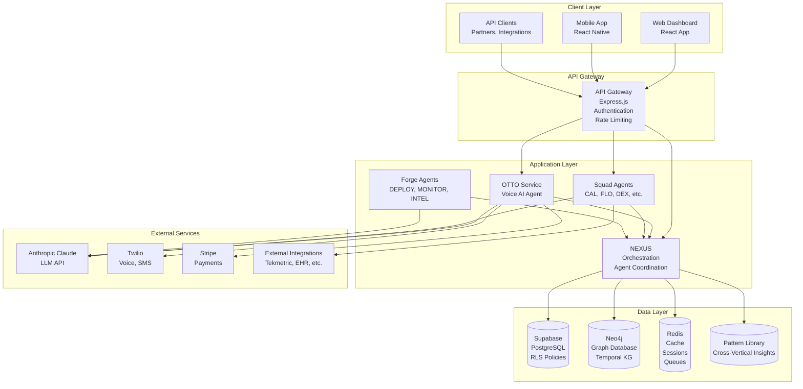
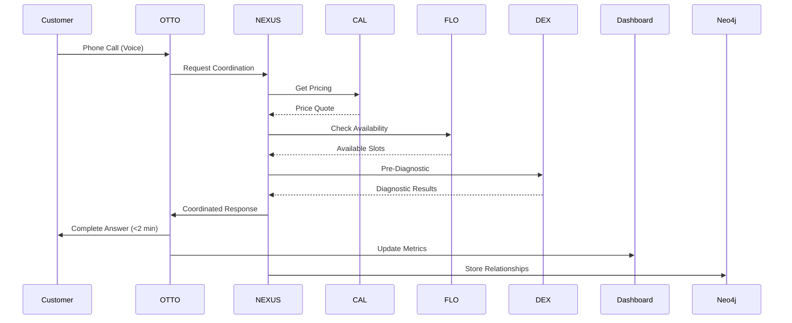

# Technical Architecture Documentation
**Complete System Architecture for Cobalt AI Platform**

**Version:** 1.0  
**Date:** 2024-12-21  
**Status:** Production-Ready - Technical Reference for Engineers

---

## Table of Contents

1. [System Overview](#system-overview)
2. [Architecture Diagrams](#architecture-diagrams)
3. [Component Descriptions](#component-descriptions)
4. [Data Flow](#data-flow)
5. [API Contracts](#api-contracts)
6. [Deployment Architecture](#deployment-architecture)
7. [Infrastructure](#infrastructure)
8. [Security Model](#security-model)

---

## System Overview

### High-Level Architecture

Cobalt AI Platform is built on a **tri-channel architecture** that enables simultaneous learning across customer communication, platform intelligence, and product interface layers. The system uses:

- **Microservices Architecture:** Independent services for agents, APIs, and data processing
- **Event-Driven Communication:** Agents communicate via message queues and event streams
- **Graph Database (Neo4j):** Temporal knowledge graph for entity relationships and historical queries
- **Relational Database (Supabase/PostgreSQL):** Transactional data, customer records, configurations
- **Serverless Functions:** Agent execution, API endpoints, background processing
- **Real-Time Infrastructure:** WebSockets, message queues, event streaming

### Technology Stack

**Backend:**
- Runtime: Node.js 20+ (TypeScript)
- Framework: Express.js (REST APIs), Fastify (high-performance endpoints)
- Database: Supabase (PostgreSQL), Neo4j (graph database)
- Message Queue: Redis (pub/sub), RabbitMQ (task queues)
- Cache: Redis (sessions, API responses)

**Frontend:**
- Framework: React 18+ (TypeScript)
- State Management: Zustand, React Query
- UI Components: Tailwind CSS, Radix UI
- Real-Time: WebSockets (Socket.io)

**Infrastructure:**
- Hosting: Railway (application), Supabase (database), Neo4j Desktop/Cloud (graph)
- CDN: Cloudflare (static assets, API acceleration)
- Monitoring: Custom homeostatic monitor, Sentry (error tracking)
- Logging: Railway logs, Supabase logs, custom logging system

**Integrations:**
- LLM: Anthropic Claude (Sonnet 4)
- Voice: Twilio (phone, SMS)
- Payments: Stripe (subscriptions, invoices)
- Email: SendGrid (transactional)

---

## Architecture Diagrams

### System Architecture Overview



### Agent Coordination Flow



---

## Component Descriptions

### OTTO Service (Voice AI Agent)

**Purpose:** Primary customer-facing agent that handles voice calls, SMS, and chat interactions.

**Responsibilities:**
- Receive and process incoming calls (Twilio webhooks)
- Conduct 5-stage OODA intake conversations
- Coordinate with Squad agents via NEXUS
- Maintain conversation context and history
- Convert voice to text, process, generate responses
- Update dashboard in real-time

**Technology:**
- Node.js/TypeScript
- Twilio SDK (voice, SMS)
- Anthropic SDK (Claude API)
- WebSocket server (real-time updates)

**Key Functions:**
```typescript
interface OTTOService {
  handleIncomingCall(callSid: string, from: string, to: string): Promise<CallResponse>;
  processConversation(message: string, context: ConversationContext): Promise<AgentResponse>;
  coordinateAgents(request: CoordinationRequest): Promise<CoordinatedResponse>;
  updateDashboard(metrics: DashboardMetrics): Promise<void>;
}
```

**Performance Targets:**
- Response time: <1 second (voice → response)
- Uptime: 99.9%+
- Concurrent calls: 100+ per instance

---

### NEXUS (Platform Orchestration Service)

**Purpose:** Coordinates all agents (Forge and Squad) and manages cross-vertical communication.

**Responsibilities:**
- Route requests to appropriate agents
- Manage agent communication protocols
- Handle cross-vertical pattern distribution
- Enforce vertical isolation (data separation)
- Monitor agent health and performance
- Resolve conflicts between agents

**Technology:**
- Node.js/TypeScript
- Redis pub/sub (agent communication)
- Message queues (task distribution)
- GraphQL API (agent queries)

**Key Functions:**
```typescript
interface NEXUSService {
  coordinate(request: CoordinationRequest): Promise<CoordinatedResponse>;
  distributePattern(pattern: Pattern, targetVerticals: string[]): Promise<void>;
  monitorHealth(): Promise<HealthStatus>;
  resolveConflict(conflict: AgentConflict): Promise<Resolution>;
}
```

---

### Temporal Knowledge Graph (Neo4j)

**Purpose:** Stores entity relationships with bi-temporal tracking (event time + ingestion time).

**Responsibilities:**
- Store entities (customers, vehicles, appointments, etc.)
- Track relationships with temporal validity
- Enable historical queries (point-in-time queries)
- Real-time entity resolution (<1s per conversation)
- Sub-200ms query performance

**Technology:**
- Neo4j Graph Database
- Cypher query language
- Custom TypeScript driver wrapper

**Schema:**
```cypher
// Nodes
(:Customer {id, name, created_at})
(:Vehicle {id, vin, year, make, model})
(:Service {id, type, date, amount})
(:Mechanic {id, name})

// Relationships (with temporal properties)
(:Customer)-[:OWNS {valid_from, valid_to, ingested_at, invalidated_at}]->(:Vehicle)
(:Customer)-[:PREFERRED_MECHANIC {valid_from, valid_to}]->(:Mechanic)
(:Vehicle)-[:HAS_SERVICE {valid_from, date, amount}]->(:Service)
```

**Performance Targets:**
- Query latency: <200ms (95th percentile)
- Entity resolution: <1s per conversation
- Concurrent queries: 1,000+ per second

---

### Supabase Database (PostgreSQL)

**Purpose:** Relational data storage with Row-Level Security (RLS) for multi-tenant isolation.

**Key Tables:**
- `customers` - Customer accounts
- `locations` - Business locations (shops, clinics)
- `appointments` - Scheduled appointments
- `calls` - Call logs and transcripts
- `integrations` - Third-party integrations
- `patterns` - Cross-vertical pattern library (anonymized)

**Row-Level Security (RLS):**
- Each customer can only access their own data
- Vertical isolation (auto customers can't see medical data)
- Admin access (platform-level access for Forge agents)

**Performance Targets:**
- Query latency: <100ms (simple queries)
- Transaction throughput: 1,000+ TPS
- Backup: Daily automated backups

---

## Data Flow

### Customer Call Flow

1. **Call Initiation:**
   - Customer calls shop/clinic number
   - Twilio receives call, sends webhook to OTTO service
   - OTTO service creates call record in Supabase

2. **Conversation Processing:**
   - OTTO transcribes voice → text (Twilio)
   - OTTO sends text to Claude API (Anthropic)
   - Claude generates response (with context from Knowledge Graph)
   - OTTO converts response → voice (Twilio)

3. **Agent Coordination:**
   - OTTO sends coordination request to NEXUS
   - NEXUS routes to appropriate Squad agents (CAL, FLO, DEX)
   - Agents process in parallel (pricing, availability, diagnostics)
   - NEXUS aggregates responses, returns to OTTO

4. **Data Storage:**
   - Call transcript stored in Supabase
   - Entities extracted and stored in Neo4j (real-time)
   - Relationships created (customer → vehicle → service)
   - Metrics updated in dashboard (real-time via WebSocket)

5. **Pattern Extraction:**
   - LANCE agent analyzes conversation outcomes
   - Extracts patterns (if applicable)
   - Stores in Pattern Library (anonymized)
   - Distributes to other verticals (if validated)

---

### Cross-Vertical Pattern Flow

1. **Pattern Discovery:**
   - FORGE_INTELLIGENCE analyzes vertical data (anonymized)
   - Identifies successful patterns (e.g., "48-hour confirmations reduce no-shows 32%")
   - Validates pattern (statistical significance, sample size)

2. **Pattern Extraction:**
   - LANCE agent extracts pattern metadata (anonymized, no PHI)
   - Stores in Pattern Library (Supabase)
   - Tags with vertical source and target verticals

3. **Pattern Distribution:**
   - LANCE notifies target verticals (e.g., medical receives auto patterns)
   - NEXUS routes pattern to vertical-specific agents
   - Agents implement pattern (e.g., M-FLO implements 48-hour confirmations)

4. **Pattern Validation:**
   - Target vertical tests pattern (A/B test)
   - Measures effectiveness (conversion rate, no-show reduction)
   - Reports results back to Pattern Library
   - Pattern marked as validated or invalidated

---

## API Contracts

### REST API Endpoints

**Base URL:** `https://api.cobaltai.com/v1`

**Authentication:**
- API Key (header: `X-API-Key: <key>`)
- OAuth 2.0 (Bearer token: `Authorization: Bearer <token>`)

**Core Endpoints:**

```typescript
// Customers
GET    /customers                    // List customers
POST   /customers                    // Create customer
GET    /customers/:id                // Get customer
PUT    /customers/:id                // Update customer
DELETE /customers/:id                // Delete customer

// Locations
GET    /locations                    // List locations
POST   /locations                    // Create location
GET    /locations/:id                // Get location
GET    /locations/:id/metrics        // Get location metrics

// Calls
GET    /calls                        // List calls (filtered)
GET    /calls/:id                    // Get call details
GET    /calls/:id/transcript         // Get call transcript
GET    /calls/:id/recording          // Get call recording URL

// Appointments
GET    /appointments                 // List appointments
POST   /appointments                 // Create appointment
GET    /appointments/:id             // Get appointment
PUT    /appointments/:id             // Update appointment
DELETE /appointments/:id             // Cancel appointment

// Integrations
GET    /integrations                 // List integrations
POST   /integrations                 // Create integration
GET    /integrations/:id             // Get integration
PUT    /integrations/:id             // Update integration
DELETE /integrations/:id             // Delete integration

// Knowledge Graph
GET    /knowledge-graph/entities/:id // Get entity details
GET    /knowledge-graph/relationships // Get entity relationships
POST   /knowledge-graph/query        // Execute graph query

// Patterns
GET    /patterns                     // List patterns (filtered by vertical)
GET    /patterns/:id                 // Get pattern details
POST   /patterns                     // Submit pattern (LANCE only)
```

**Response Format:**
```typescript
interface APIResponse<T> {
  success: boolean;
  data?: T;
  error?: {
    code: string;
    message: string;
    details?: any;
  };
  meta?: {
    page?: number;
    limit?: number;
    total?: number;
  };
}
```

---

### Webhooks

**Webhook Events:**
- `call.received` - New call received
- `call.completed` - Call ended
- `appointment.created` - Appointment booked
- `appointment.cancelled` - Appointment cancelled
- `integration.sync.completed` - Integration sync finished
- `pattern.extracted` - New pattern discovered (LANCE)

**Webhook Payload:**
```typescript
interface WebhookPayload {
  event: string;
  timestamp: string;
  data: any;
  signature: string; // HMAC signature for verification
}
```

---

## Deployment Architecture

### Production Environment

**Application Services (Railway):**
- API Gateway (Express.js) - Auto-scaling (2-10 instances)
- OTTO Service (Node.js) - Auto-scaling (3-20 instances)
- Squad Agents (Node.js) - Auto-scaling (5-30 instances)
- Forge Agents (Node.js) - Fixed (2-5 instances)

**Databases:**
- Supabase (PostgreSQL) - Managed, auto-scaling, daily backups
- Neo4j - Dedicated instance, 8GB RAM, daily backups
- Redis - Managed instance, 2GB RAM

**CDN & Edge:**
- Cloudflare - Static assets, API acceleration, DDoS protection

**Monitoring:**
- Custom Homeostatic Monitor - Real-time system health
- Sentry - Error tracking and alerting
- Railway Metrics - Infrastructure monitoring

### Staging Environment

**Mirrors production:** Same architecture, smaller scale (1-2 instances per service)

**Purpose:** Pre-production testing, integration testing, customer demos

---

## Infrastructure

### Hosting

**Railway:**
- Application hosting (Node.js services)
- Auto-scaling based on CPU/memory
- Environment variables management
- Log aggregation
- Deployment automation (Git-based)

**Supabase:**
- PostgreSQL database (managed)
- Row-Level Security (RLS)
- Real-time subscriptions (WebSockets)
- Storage (file uploads)
- Authentication (if needed)

**Neo4j:**
- Neo4j Desktop (local development)
- Neo4j Cloud (production) - Dedicated instance

### Scaling Strategy

**Horizontal Scaling:**
- API Gateway: Auto-scale 2-10 instances (based on request rate)
- OTTO Service: Auto-scale 3-20 instances (based on call volume)
- Squad Agents: Auto-scale 5-30 instances (based on task queue depth)

**Database Scaling:**
- Supabase: Read replicas (if needed for >10K locations)
- Neo4j: Cluster mode (if needed for >10K locations)
- Redis: Cluster mode (if needed for >100K requests/sec)

**Caching Strategy:**
- API responses: Redis cache (5-minute TTL)
- Knowledge Graph queries: Redis cache (1-minute TTL)
- Session data: Redis (30-minute TTL)

---

## Security Model

### Authentication & Authorization

**Customer Authentication:**
- Email/password (Supabase Auth)
- OAuth 2.0 (Google, Microsoft) - Optional
- API keys (for integrations)

**API Authentication:**
- API keys (per customer, per integration)
- OAuth 2.0 (for partner integrations)
- Rate limiting (100 requests/minute per API key)

**Admin Authentication:**
- SSO (Okta, Azure AD) - Enterprise customers
- Multi-factor authentication (MFA) required

### Data Isolation

**Row-Level Security (RLS):**
- Each customer can only access their own data
- Vertical isolation (auto customers can't see medical data)
- Platform-level access (Forge agents have admin access)

**Encryption:**
- Data at rest: Encrypted (Supabase, Neo4j)
- Data in transit: TLS 1.3 (all connections)
- PHI (Medical): Field-level encryption (additional layer)

### Compliance

**HIPAA (Medical Vertical):**
- Business Associate Agreements (BAAs) with all vendors
- Audit logging (7-year retention)
- Access controls (RBAC)
- Breach notification procedures

**SOC2 Type I (Month 3):**
- Access controls
- Encryption (at rest, in transit)
- Audit logging
- Incident response procedures
- Security monitoring

---

**Technical Architecture Complete**  
**Status: Production-Ready - Technical Reference**  
**Target: Support 10K+ locations, 1M+ requests/day**


